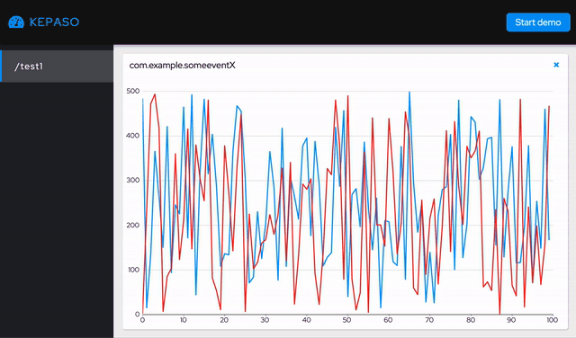
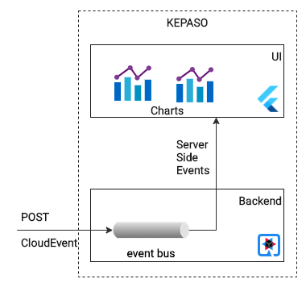
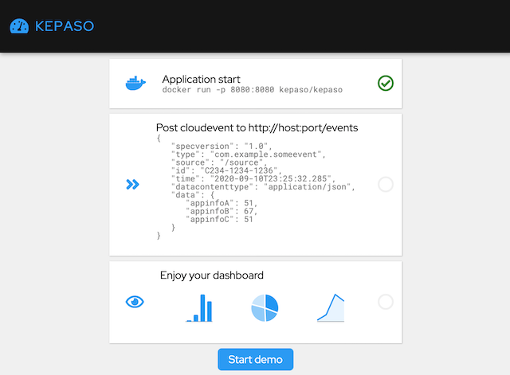

# KEPASO


Small and easy-to-use Dashboard for CloudEvents.  


 
## Requirements
- User should be able to POST data is JSON CloudEvent format
- User should be able to observe data as a Chart
- User should be able to start application in Docker container

## Architecture


- UI - Flutter-based web interface
- Backend Quarkus-based application

## Build 
Requires Git and Docker installed.
```
git clone git@github.com:mgubaidullin/kepaso.git
docker build -t kepaso/kepaso .
```

## Run
Application start
```
docker run -p 8080:8080 kepaso/kepaso
open http://localhost:8080
```

Post cloudevent to ```http://host:port/events```
```
{
    "specversion": "1.0",
    "type": "com.example.someeventX",
    "source": "/some-source",
    "id": "C234-1234-1232",
    "time": "2018-04-05T17:31:00Z",
    "datacontenttype": "application/json",
    "data": {
        "appinfoA": 123,
        "appinfoB": 456,
        "appinfoC": 789
    }
}
```
Command-line demo:
```
curl -X POST "http://0.0.0.0:8080/events" -H  "accept: application/json" -H  "Content-Type: application/json" -d '{"specversion" : "1.0","type" : "com.example.someevent","source" : "/mycontext1","id" : "C234-1234-1232","time" : "2018-04-05T17:31:00Z","datacontenttype" : "application/json","data" : {"value" : 1220,"appinfoB" : 1,"appinfoC" : 500}}'
```

UI demo (click "Start demo" button):



**Enjoy your dashboard!**
</br>
</br>
</br>
## Performance
Startup time
```
kepaso 1.0.0 native (powered by Quarkus 1.7.3.Final) started in 0.039s.
```
Container size
```
REPOSITORY                 IMAGE ID            CREATED             SIZE
kepaso/kepaso              35e7dda20516        16 minutes ago      61.2MB
```
Memory usage after start
```
CONTAINER ID        NAME                CPU %               MEM USAGE 
5f77fd99167d        kepaso              0.01%               5.488MiB
```
Memory usage while processing 1000s of events processed
```
CONTAINER ID        NAME                CPU %               MEM USAGE 
5f77fd99167d        kepaso              12.43%              21.03MiB
```